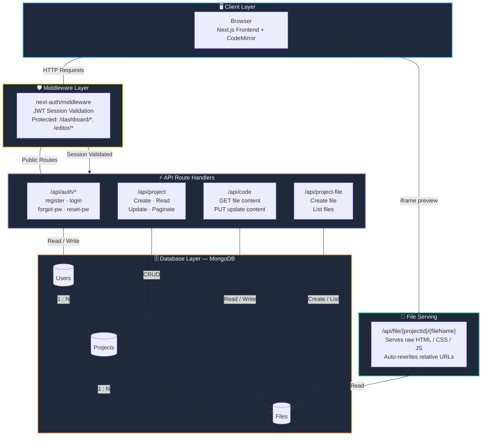
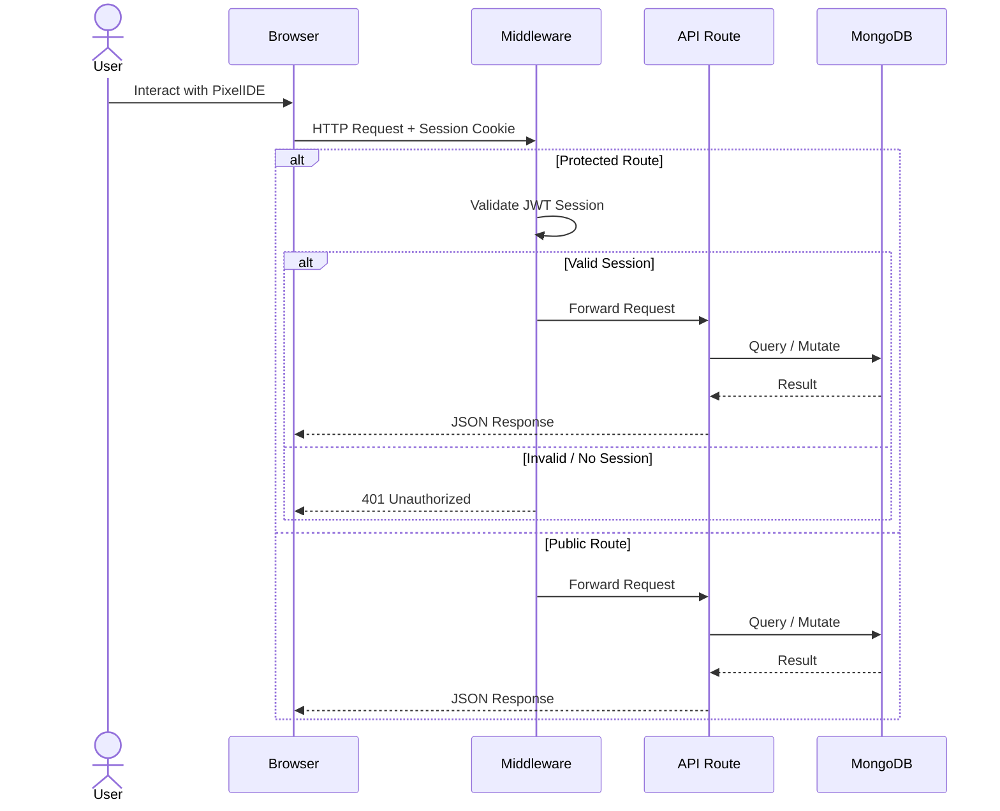
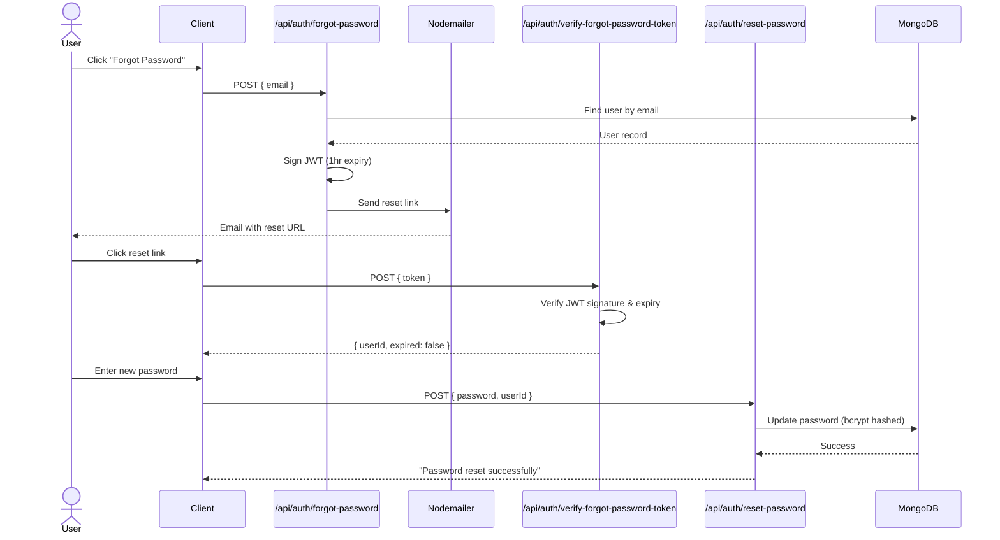

# 📡 PixelIDE — API Documentation

**Version:** `0.1.0` &nbsp;|&nbsp; **Framework:** Next.js 15 (App Router) &nbsp;|&nbsp; **Auth:** NextAuth.js (JWT) &nbsp;|&nbsp; **Database:** MongoDB (Mongoose)

---

## Table of Contents

- [Overview](#overview)
- [Base URL](#base-url)
- [Authentication](#authentication)
- [Error Handling](#error-handling)
- [Data Models](#data-models)
  - [User](#user-model)
  - [Project](#project-model)
  - [File](#file-model)
- [API Endpoints](#api-endpoints)
  - [Auth — Registration](#1-register-user)
  - [Auth — Login (NextAuth)](#2-login-nextauth)
  - [Auth — Forgot Password](#3-forgot-password)
  - [Auth — Verify Reset Token](#4-verify-forgot-password-token)
  - [Auth — Reset Password](#5-reset-password)
  - [Projects — Create](#6-create-project)
  - [Projects — List / Get](#7-get-projects)
  - [Projects — Update](#8-update-project)
  - [Projects — Recent](#9-get-recent-projects)
  - [Files — Create](#10-create-file)
  - [Files — List by Project](#11-get-files-by-project)
  - [Files — Serve Raw Content](#12-serve-file-content)
  - [Code — Get File](#13-get-file-by-project--name)
  - [Code — Update File Content](#14-update-file-content)
- [Rate Limiting & Security](#rate-limiting--security)
- [Environment Variables](#environment-variables)

---

## Overview

PixelIDE is a browser-based code editor that allows users to create and manage HTML/CSS/JS projects directly from their browser. This document describes all RESTful API endpoints exposed by the Next.js backend.

All API routes are located under `/api/` and follow the **Next.js App Router** conventions. Protected routes require a valid **NextAuth JWT session**.

---

## Base URL

| Environment | URL |
|---|---|
| **Local Development** | `http://localhost:3000/api` |
| **Production** | `https://pixel-ide.vercel.app/api` |

---

## Authentication

PixelIDE uses **NextAuth.js** with the **Credentials** provider and **JWT** session strategy.

### How It Works

1. Users authenticate via `POST /api/auth/callback/credentials` (managed by NextAuth).
2. On successful login, a signed **JWT** is issued and stored in a secure, HTTP-only cookie (`next-auth.session-token`).
3. All protected endpoints validate the session server-side using `getServerSession(authOptions)`.
4. Sessions expire after **30 days** by default.

### Protected vs. Public Endpoints

| Type | Endpoints |
|---|---|
| 🔓 **Public** | `POST /api/auth/register`, `POST /api/auth/forgot-password`, `POST /api/auth/verify-forgot-password-token`, `POST /api/auth/reset-password` |
| 🔒 **Protected** | All `/api/project/*`, `/api/project-file/*`, `/api/code/*`, `/api/recent-project-update/*` |
| 🔑 **NextAuth Managed** | `GET/POST /api/auth/[...nextauth]` |

> **Note:** Protected endpoints return `401 Unauthorized` if no valid session is present.

---

## Error Handling

All API responses follow a consistent JSON structure.

### Success Response

```json
{
  "message": "Descriptive success message",
  "data": { ... }
}
```

### Error Response

```json
{
  "error": "Descriptive error message"
}
```

### Standard HTTP Status Codes

| Code | Meaning | When Used |
|---|---|---|
| `200` | OK | Successful read/update operations |
| `201` | Created | Successful resource creation |
| `400` | Bad Request | Missing required fields, validation errors, duplicate resources |
| `401` | Unauthorized | Missing or invalid authentication session |
| `404` | Not Found | Requested resource does not exist |
| `500` | Internal Server Error | Unexpected server-side failures |

---

## Data Models

### User Model

> **Collection:** `users`

| Field | Type | Required | Description |
|---|---|---|---|
| `_id` | `ObjectId` | Auto | Unique identifier |
| `name` | `String` | ✅ | User's display name |
| `email` | `String` | ✅ | Unique email address |
| `picture` | `String` | ❌ | Profile picture URL (default: `""`) |
| `password` | `String` | ✅ | Bcrypt-hashed password (auto-hashed on save) |
| `refreshToken` | `String` | ❌ | Refresh token (default: `""`) |
| `createdAt` | `Date` | Auto | Timestamp of creation |
| `updatedAt` | `Date` | Auto | Timestamp of last update |

**Hooks:**
- `pre('save')` — Automatically hashes the password using `bcryptjs` (salt rounds: 10) when the `password` field is modified.

---

### Project Model

> **Collection:** `projects`

| Field | Type | Required | Description |
|---|---|---|---|
| `_id` | `ObjectId` | Auto | Unique identifier |
| `name` | `String` | ✅ | Project name (unique per user) |
| `userId` | `ObjectId` | ✅ | Reference to the owning `User` |
| `createdAt` | `Date` | Auto | Timestamp of creation |
| `updatedAt` | `Date` | Auto | Timestamp of last update |

---

### File Model

> **Collection:** `files`

| Field | Type | Required | Description |
|---|---|---|---|
| `_id` | `ObjectId` | Auto | Unique identifier |
| `name` | `String` | ✅ | File name (e.g., `index.html`) |
| `extension` | `String` | Auto | File extension, derived from `name` |
| `content` | `String` | ❌ | File content (default: `""`) |
| `projectId` | `ObjectId` | ✅ | Reference to the parent `Project` |
| `createdAt` | `Date` | Auto | Timestamp of creation |
| `updatedAt` | `Date` | Auto | Timestamp of last update |

**Indexes:**
- Compound unique index on `{ projectId, name }` — ensures file names are unique within a project.

**Hooks:**
- `pre('save')` — Automatically extracts and sets the `extension` field from the file `name` when modified.

---

## API Endpoints

---

### 🔐 Authentication

---

#### 1. Register User

Creates a new user account.

```
POST /api/auth/register
```

**Request Body:**

```json
{
  "name": "John Doe",
  "email": "john@example.com",
  "password": "securePassword123"
}
```

| Field | Type | Required | Description |
|---|---|---|---|
| `name` | `string` | ✅ | User's full name |
| `email` | `string` | ✅ | Valid email address |
| `password` | `string` | ✅ | Account password (hashed on storage) |

**Responses:**

| Status | Body | Description |
|---|---|---|
| `201` | `{ "message": "User registered successfully" }` | Account created |
| `400` | `{ "message": "Please fill all fields" }` | Missing required fields |
| `400` | `{ "message": "User already exists" }` | Duplicate email |
| `500` | `{ "message": "Failed to register user" }` | Server error |

---

#### 2. Login (NextAuth)

Handled entirely by NextAuth.js. Use the NextAuth client-side `signIn()` function or call the credentials endpoint directly.

```
POST /api/auth/callback/credentials
```

**Request Body (form-encoded or JSON via NextAuth client):**

| Field | Type | Required | Description |
|---|---|---|---|
| `email` | `string` | ✅ | Registered email address |
| `password` | `string` | ✅ | Account password |

**Behavior:**
- On success: Sets a secure `next-auth.session-token` cookie and redirects to `/dashboard`.
- On failure: Redirects to `/login` with an error.

**Additional NextAuth Endpoints:**

| Endpoint | Method | Description |
|---|---|---|
| `/api/auth/signin` | `GET` | Sign-in page |
| `/api/auth/signout` | `POST` | Sign out and clear session |
| `/api/auth/session` | `GET` | Get current session data |
| `/api/auth/csrf` | `GET` | Get CSRF token |
| `/api/auth/providers` | `GET` | List configured auth providers |

---

#### 3. Forgot Password

Sends a password reset email with a signed JWT link.

```
POST /api/auth/forgot-password
```

**Request Body:**

```json
{
  "email": "john@example.com"
}
```

| Field | Type | Required | Description |
|---|---|---|---|
| `email` | `string` | ✅ | Registered email address |

**Responses:**

| Status | Body | Description |
|---|---|---|
| `200` | `{ "message": "Check your email for the reset password link." }` | Email sent |
| `400` | `{ "error": "Email is required" }` | Missing email |
| `404` | `{ "error": "User not found" }` | No account with this email |
| `500` | `{ "error": "Something went wrong. Please try again." }` | Server error |

**Notes:**
- Generates a JWT token signed with `FORGOT_PASSWORD_SECRET_KEY` that expires in **1 hour**.
- The reset URL format: `{domain}/reset-password?token={jwt_token}`
- Email is sent via **Nodemailer** using a custom HTML template.

---

#### 4. Verify Forgot Password Token

Validates a password reset token and returns the associated user ID.

```
POST /api/auth/verify-forgot-password-token
```

**Request Body:**

```json
{
  "token": "eyJhbGciOiJIUzI1NiIs..."
}
```

| Field | Type | Required | Description |
|---|---|---|---|
| `token` | `string` | ✅ | JWT token from the reset email |

**Responses:**

| Status | Body | Description |
|---|---|---|
| `200` | `{ "message": "Token is valid", "expired": false, "userId": "64a..." }` | Valid token |
| `400` | `{ "error": "Token is required" }` | Missing token |
| `401` | `{ "error": "Invalid or expired token", "expired": true }` | Token expired or tampered |
| `500` | `{ "error": "Internal Server Error" }` | Server error |

---

#### 5. Reset Password

Resets the user's password after token verification.

```
POST /api/auth/reset-password
```

**Request Body:**

```json
{
  "password": "newSecurePassword456",
  "userId": "64a7f2b..."
}
```

| Field | Type | Required | Description |
|---|---|---|---|
| `password` | `string` | ✅ | New password |
| `userId` | `string` | ✅ | User ID obtained from token verification |

**Responses:**

| Status | Body | Description |
|---|---|---|
| `200` | `{ "message": "Password reset successfully" }` | Password updated |
| `400` | `{ "error": "Password and User ID are required" }` | Missing fields |
| `400` | `{ "error": "New password must be different from old password" }` | Same password reuse |
| `404` | `{ "error": "User not found" }` | Invalid user ID |
| `500` | `{ "error": "Internal Server Error" }` | Server error |

---

### 📁 Projects

---

#### 6. Create Project

Creates a new project with boilerplate files (`index.html`, `style.css`, `script.js`).

```
POST /api/project
```

🔒 **Requires Authentication**

**Request Body:**

```json
{
  "name": "My Awesome Project"
}
```

| Field | Type | Required | Description |
|---|---|---|---|
| `name` | `string` | ✅ | Unique project name (per user) |

**Responses:**

| Status | Body | Description |
|---|---|---|
| `201` | `{ "message": "Project created successfully", "projectId": "64a..." }` | Project created with 3 boilerplate files |
| `400` | `{ "message": "Project name is required" }` | Missing name |
| `400` | `{ "message": "Project already exists" }` | Duplicate name for this user |
| `401` | `{ "message": "Unauthorized" }` | Not authenticated |
| `500` | `{ "message": "Error creating project", "error": "..." }` | Server error |

**Side Effects:**
- Automatically creates three files:
  - `index.html` — HTML boilerplate
  - `style.css` — CSS boilerplate
  - `script.js` — JavaScript boilerplate

---

#### 7. Get Projects

Retrieves a paginated list of the authenticated user's projects, or a single project by ID.

```
GET /api/project
```

🔒 **Requires Authentication**

**Query Parameters:**

| Parameter | Type | Default | Description |
|---|---|---|---|
| `projectId` | `string` | — | Optional. Filter by specific project ID |
| `page` | `number` | `1` | Page number for pagination |
| `limit` | `number` | `6` | Number of projects per page |

**Example Requests:**

```
GET /api/project?page=1&limit=6
GET /api/project?projectId=64a7f2b...
```

**Responses:**

| Status | Body | Description |
|---|---|---|
| `200` | `{ "message": "Projects fetched successfully", "data": [...], "totalPages": 3, "totalCount": 15 }` | Success |
| `401` | `{ "message": "Unauthorized" }` | Not authenticated |
| `500` | `{ "message": "Error fetching projects", "error": "..." }` | Server error |

**Response Data Shape:**

```json
{
  "message": "Projects fetched successfully",
  "data": [
    {
      "_id": "64a7f2b...",
      "name": "My Project",
      "userId": "64a7f2a...",
      "createdAt": "2026-04-10T12:00:00.000Z"
    }
  ],
  "totalPages": 3,
  "totalCount": 15
}
```

> **Note:** Results are sorted by `createdAt` in **descending** order (newest first). Fields `__v` and `updatedAt` are excluded.

---

#### 8. Update Project

Renames an existing project.

```
PUT /api/project
```

🔒 **Requires Authentication**

**Request Body:**

```json
{
  "name": "Updated Project Name",
  "projectId": "64a7f2b..."
}
```

| Field | Type | Required | Description |
|---|---|---|---|
| `name` | `string` | ✅ | New project name |
| `projectId` | `string` | ✅ | ID of the project to update |

**Responses:**

| Status | Body | Description |
|---|---|---|
| `200` | `{ "message": "Project updated successfully", "data": { ... } }` | Project renamed |
| `400` | `{ "error": "Project name is required" }` | Missing name |
| `401` | `{ "error": "Unauthorized" }` | Not authenticated |
| `500` | `{ "error": "Error in PUT /api/project" }` | Server error |

---

#### 9. Get Recent Projects

Retrieves the 10 most recently created projects for the authenticated user.

```
GET /api/recent-project-update
```

🔒 **Requires Authentication**

**Query Parameters:** None

**Responses:**

| Status | Body | Description |
|---|---|---|
| `200` | `{ "message": "Recent project fetched successfully", "data": [...] }` | Success |
| `401` | `{ "message": "Unauthorized" }` | Not authenticated |
| `500` | `{ "error": "Error in GET /api/recent-project-update" }` | Server error |

**Response Data Shape:**

```json
{
  "message": "Recent project fetched successfully",
  "data": [
    {
      "_id": "64a7f2b...",
      "name": "Latest Project",
      "userId": "64a7f2a...",
      "createdAt": "2026-04-10T12:00:00.000Z"
    }
  ]
}
```

> **Note:** Returns a maximum of **10 projects**, sorted by `createdAt` descending. Fields `__v` and `updatedAt` are excluded.

---

### 📄 Files

---

#### 10. Create File

Creates a new file within a project.

```
POST /api/project-file
```

🔒 **Requires Authentication**

**Request Body:**

```json
{
  "name": "app.js",
  "projectId": "64a7f2b..."
}
```

| Field | Type | Required | Description |
|---|---|---|---|
| `name` | `string` | ✅ | File name with extension (e.g., `app.js`) |
| `projectId` | `string` | ✅ | ID of the parent project |

**Responses:**

| Status | Body | Description |
|---|---|---|
| `201` | `{ "message": "File created successfully", "data": { ... } }` | File created |
| `400` | `{ "error": "Name and projectId are required" }` | Missing fields |
| `400` | `{ "error": "File already exists" }` | Duplicate filename in project |
| `401` | `{ "error": "Unauthorized" }` | Not authenticated |
| `500` | `{ "error": "Something went wrong" }` | Server error |

> **Note:** Files are created with empty content by default. The `extension` field is automatically derived from the file name.

---

#### 11. Get Files by Project

Lists all files belonging to a project (without file content).

```
GET /api/project-file
```

🔒 **Requires Authentication**

**Query Parameters:**

| Parameter | Type | Required | Description |
|---|---|---|---|
| `projectId` | `string` | ✅ | ID of the project |

**Example Request:**

```
GET /api/project-file?projectId=64a7f2b...
```

**Responses:**

| Status | Body | Description |
|---|---|---|
| `200` | `{ "message": "Files fetched successfully", "data": [...] }` | Success |
| `401` | `{ "error": "Unauthorized" }` | Not authenticated |
| `500` | `{ "error": "Something went wrong" }` | Server error |

**Response Data Shape:**

```json
{
  "message": "Files fetched successfully",
  "data": [
    {
      "_id": "64a7f2c...",
      "name": "index.html",
      "extension": "html",
      "projectId": "64a7f2b...",
      "createdAt": "2026-04-10T12:00:00.000Z",
      "updatedAt": "2026-04-10T12:00:00.000Z"
    }
  ]
}
```

> **Note:** The `content` field is **excluded** from this response to reduce payload size.

---

#### 12. Serve File Content

Serves raw file content with the appropriate `Content-Type` header. Used by the live preview iframe to load project files.

```
GET /api/file/{projectId}/{fileName}
```

🔓 **Public** (no session required)

**Path Parameters:**

| Parameter | Type | Required | Description |
|---|---|---|---|
| `projectId` | `string` | ✅ | ID of the parent project |
| `fileName` | `string` | ✅ | Full file name with extension |

**Example Request:**

```
GET /api/file/64a7f2b.../index.html
```

**Content-Type Mapping:**

| Extension | Content-Type |
|---|---|
| `.html` | `text/html` |
| `.css` | `text/css` |
| `.js` | `application/javascript` |
| Other | `text/plain` |

**Responses:**

| Status | Content-Type | Description |
|---|---|---|
| `200` | Varies | Raw file content with appropriate MIME type |
| `400` | `text/plain` | Missing `projectId` or `fileName` |
| `404` | `text/plain` | File not found |
| `500` | `text/plain` | Server error |

**Special Behavior for HTML Files:**
- Automatically rewrites relative `src` and `href` attributes to point to the correct API file-serving URLs.
- External URLs (starting with `http` or `//`) are left untouched.
- Rewrite pattern: `src="style.css"` → `src="{domain}/api/file/{projectId}/style.css"`

---

### 💻 Code

---

#### 13. Get File by Project & Name

Fetches a single file's full data (including content) by project ID and file name.

```
POST /api/code
```

🔒 **Requires Authentication**

**Request Body:**

```json
{
  "projectId": "64a7f2b...",
  "fileName": "index.html"
}
```

| Field | Type | Required | Description |
|---|---|---|---|
| `projectId` | `string` | ✅ | ID of the project |
| `fileName` | `string` | ✅ | Name of the file to retrieve |

**Responses:**

| Status | Body | Description |
|---|---|---|
| `200` | `{ "message": "File fetched successfully", "data": { ... } }` | Full file object returned |
| `400` | `{ "error": "Project ID and file name are required" }` | Missing fields |
| `401` | `{ "message": "Unauthorized" }` | Not authenticated |
| `404` | `{ "error": "File not found" }` | No matching file |
| `500` | `{ "error": "Something went wrong" }` | Server error |

**Response Data Shape:**

```json
{
  "message": "File fetched successfully",
  "data": {
    "_id": "64a7f2c...",
    "name": "index.html",
    "extension": "html",
    "content": "<!DOCTYPE html>...",
    "projectId": "64a7f2b...",
    "createdAt": "2026-04-10T12:00:00.000Z",
    "updatedAt": "2026-04-10T12:30:00.000Z"
  }
}
```

---

#### 14. Update File Content

Updates the content of an existing file.

```
PUT /api/code
```

🔒 **Requires Authentication**

**Request Body:**

```json
{
  "fileId": "64a7f2c...",
  "content": "<!DOCTYPE html>\n<html>...</html>"
}
```

| Field | Type | Required | Description |
|---|---|---|---|
| `fileId` | `string` | ✅ | ID of the file to update |
| `content` | `string` | ✅ | New file content (can be empty string) |

**Responses:**

| Status | Body | Description |
|---|---|---|
| `200` | `{ "message": "File updated successfully", "data": { ... } }` | File content updated |
| `400` | `{ "error": "File ID and content are required" }` | Missing fields |
| `401` | `{ "error": "Unauthorized" }` | Not authenticated |
| `404` | `{ "error": "File not found" }` | Invalid file ID |
| `500` | `{ "error": "Something went wrong" }` | Server error |

> **Note:** The `content` field can be an empty string (`""`), but it cannot be `undefined`.

---

## Rate Limiting & Security

| Concern | Implementation |
|---|---|
| **Authentication** | NextAuth.js with JWT strategy, HTTP-only session cookies |
| **Password Storage** | Bcrypt hashing with 10 salt rounds |
| **Session Expiry** | 30-day JWT lifespan |
| **Reset Token Expiry** | 1-hour JWT lifespan for password reset |
| **Route Protection** | Next.js middleware protects `/dashboard/*` and `/editor/*` routes |
| **CSRF Protection** | Built-in NextAuth CSRF token validation |
| **DB Connection** | Cached Mongoose connection with connection pooling (max 10) |

---

## Environment Variables

| Variable | Description | Required |
|---|---|---|
| `MONGODB_URI` | MongoDB connection string | ✅ |
| `NEXTAUTH_SECRET` | Secret key for NextAuth JWT signing | ✅ |
| `NEXTAUTH_URL` | Canonical URL of the application | ✅ |
| `FORGOT_PASSWORD_SECRET_KEY` | Secret for signing password reset tokens | ✅ |
| `EMAIL_HOST` | SMTP host for sending emails | ✅ |
| `EMAIL_PORT` | SMTP port | ✅ |
| `EMAIL_USER` | SMTP username / email address | ✅ |
| `EMAIL_PASS` | SMTP password / app password | ✅ |

---

## API Architecture Diagram



### Request Flow



### Password Reset Flow



---
