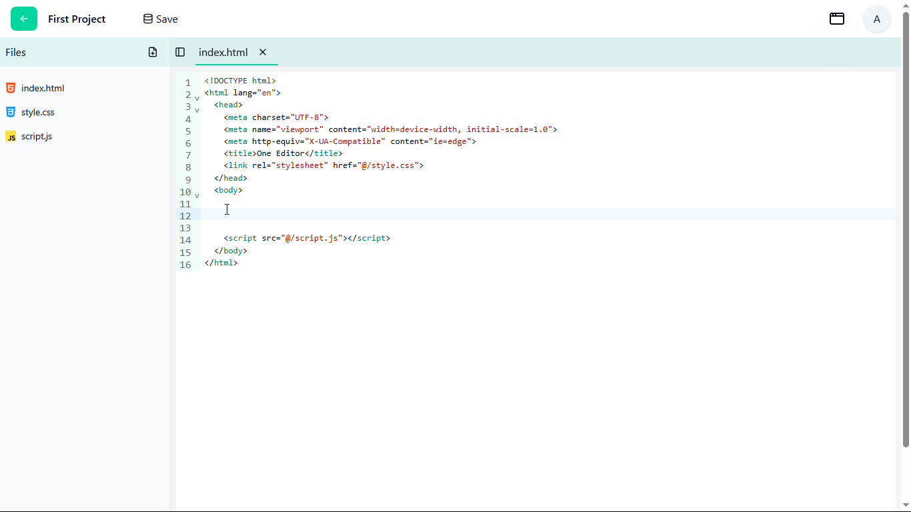
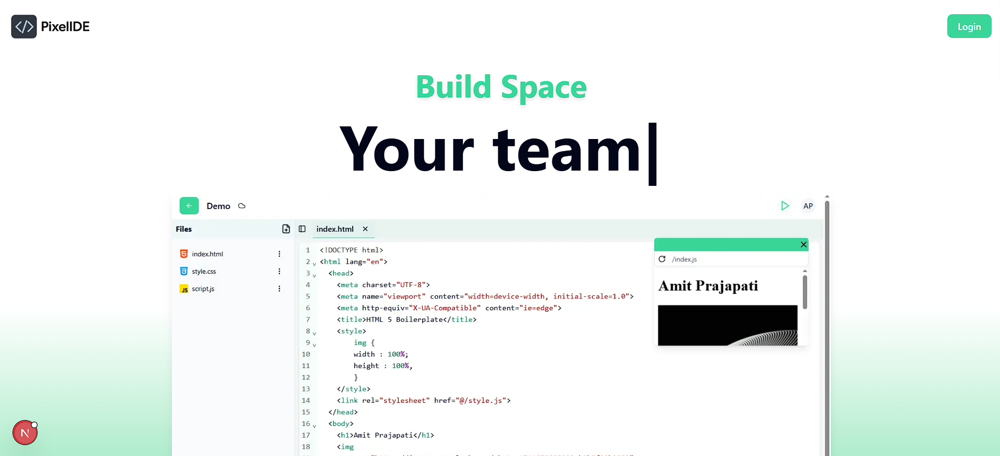
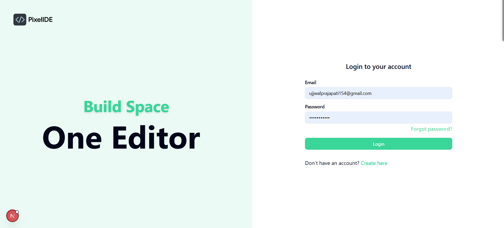
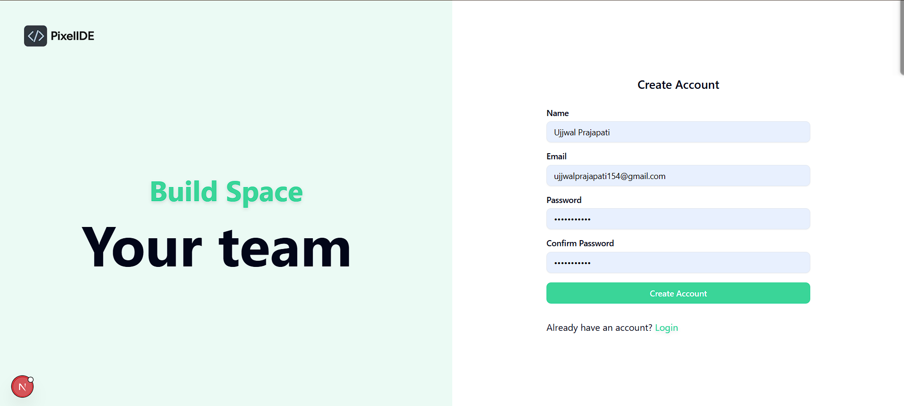
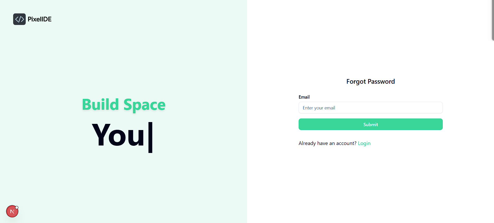
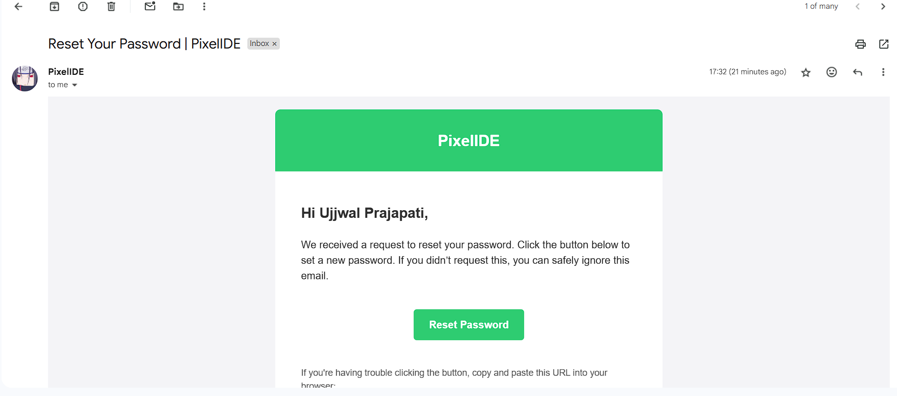
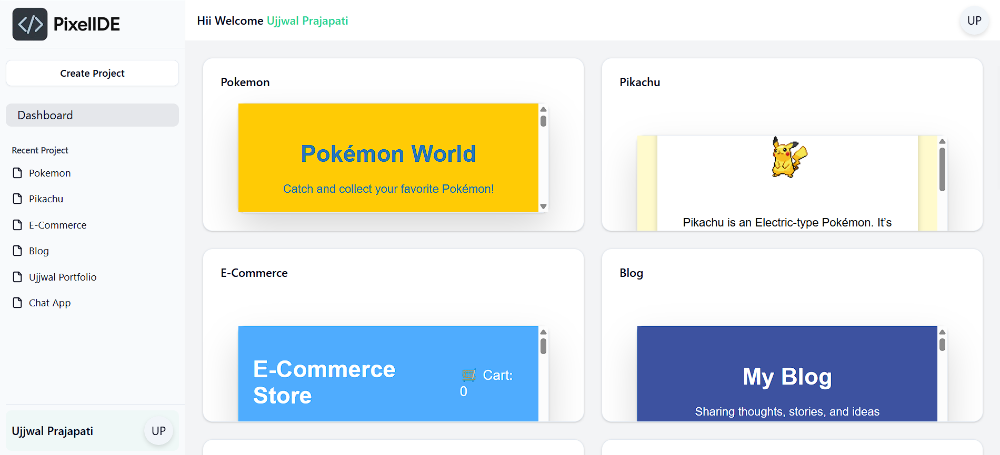
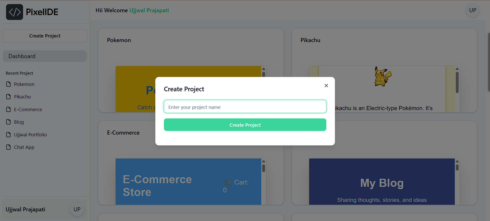
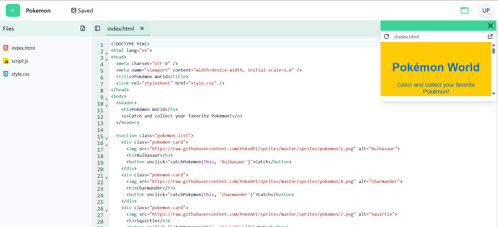

# PixelIDE 

PixelIDE is a modern, full-stack code editor built with the MERN stack and Next.js. It is designed to provide seamless and responsive coding experiences directly in the browser. With features like real-time syntax highlighting, multi-language support, and collaborative editing, PixelIDE aims to be a minimalist yet powerful tool for developers to write, run, and share code effortlessly from anywhere.



---

## Features

- **Real-Time Syntax Highlighting**: Supports multiple programming languages with instant feedback.
- **Collaborative Editing**: Work with your team in real-time.
- **Authentication**: Secure login, registration, and password reset functionality.
- **Responsive Design**: Optimized for all devices, including desktops, tablets, and mobile phones.
- **Customizable Themes**: Light and dark mode support.
- **Email Notifications**: Password reset and other email-based notifications.
- **Cloud Integration**: Save and load projects directly from the cloud.
- **Code Execution**: Run code snippets directly in the editor for supported languages.

---

## Tech Stack

### Frontend
- **Next.js**: Framework for server-rendered React applications.
- **Tailwind CSS**: Utility-first CSS framework for styling.
- **React Hook Form**: For form validation and management.
- **Shadcn UI**: For UI components.

### Backend
- **Node.js**: JavaScript runtime for server-side development.
- **Express.js**: Web framework for building APIs.
- **MongoDB**: NoSQL database for storing user and project data.
- **Mongoose**: ODM for MongoDB.
- **NextAuth.js**: Authentication library for Next.js.

### Other Tools
- **Zod**: Schema validation for forms and APIs.
- **Nodemailer**: For sending emails.
- **Axios**: HTTP client for API requests.
- **Sonner**: Toast notifications.

---

## Installation

1. Clone the repository:
   ```bash
   git clone https://github.com/UjjwalPrajapati16/pixel-ide.git
   cd pixel-ide
   ```
2. Install dependencies:
   ```bash
   npm install
   ```

3. Set up environment variables: Create a .env.local file in the root directory and add the following:

   ```bash
    MONGODB_URI=your_mongodb_connection_string
    NEXTAUTH_SECRET=your_nextauth_secret
    EMAIL_USER=your_email_address
    EMAIL_PASS=your_email_password
   ```

4. Start the development server:
   ```bash
    npm run dev
   ```

5. Open http://localhost:3000 in your browser.

---

## Screenshots

1. **Landing Page**


2. **Login Page**


3. **Register Page**


4. **Forgot Password Page**


5. **Reset Password Email**


6. **Dashboard**


7. **Create Project**


8. **Editor**



## Future Enhnacements

- **Dark Mode**: Add dark mode support.
- **Multi-Language Support**: Add support for multiple programming languages.
- **Collaborative Editing**: Add support for collaborative editing.
