# PixelIDE 

PixelIDE is a modern, full-stack browser-based code editor built with Next.js and MongoDB. It provides a seamless coding experience directly in the browser with real-time syntax highlighting, live preview, and project management. PixelIDE allows developers to create, edit, and preview HTML/CSS/JS projects effortlessly from anywhere.

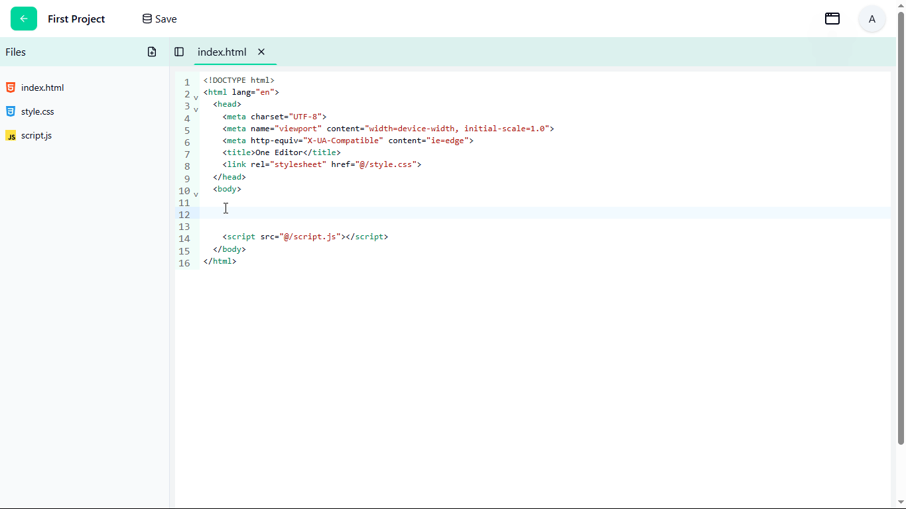

---

## Features

- **Real-Time Syntax Highlighting**: CodeMirror-powered editor with language-aware highlighting for HTML, CSS, and JavaScript.
- **Live Preview**: Draggable, resizable browser panel with iframe-based live preview that auto-refreshes on save.
- **Project Management**: Create, rename, and paginate through projects from a dashboard with project preview cards.
- **File Management**: Sidebar file tree with file creation, selection, and per-file editing.
- **Authentication**: Secure credentials-based login, registration, and full password reset flow via email.
- **Theme Support**: Light and dark mode via `next-themes`.
- **Email Notifications**: Forgot password emails sent via Nodemailer with Gmail SMTP.
- **Cloud Storage**: All projects and files are persisted in MongoDB Atlas.
- **Keyboard Shortcuts**: `Ctrl+S` / `Cmd+S` to save the current file.
- **Public Browser View**: Shareable public preview URL for any project file.

### Code Execution

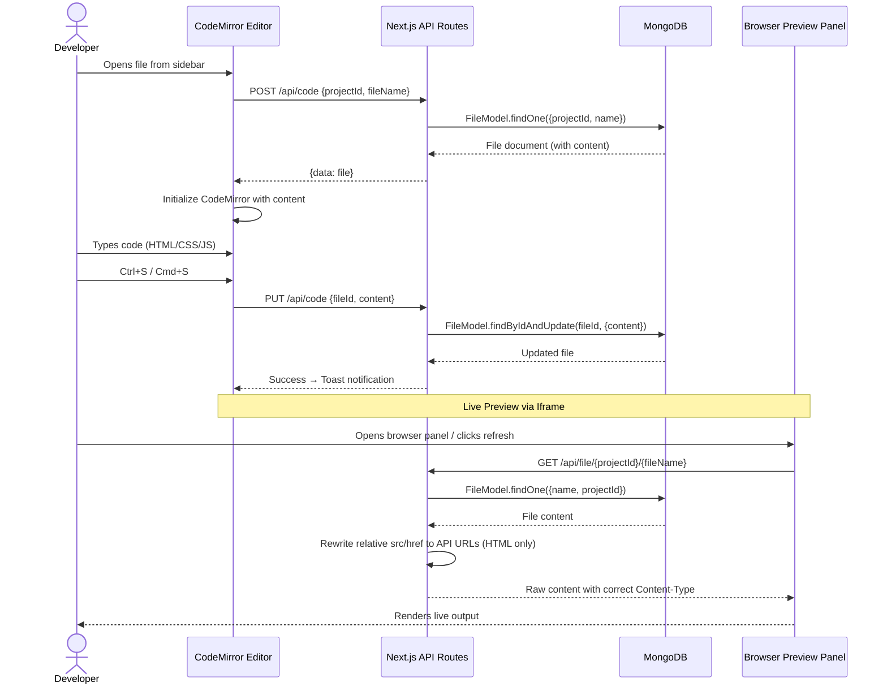
```mermaid
sequenceDiagram
    actor Dev as Developer
    participant Editor as CodeMirror Editor
    participant API as Next.js API Routes
    participant DB as MongoDB
    participant Iframe as Browser Preview Panel

    Dev->>Editor: Opens file from sidebar
    Editor->>API: POST /api/code {projectId, fileName}
    API->>DB: FileModel.findOne({projectId, name})
    DB-->>API: File document (with content)
    API-->>Editor: {data: file}
    Editor->>Editor: Initialize CodeMirror with content

    Dev->>Editor: Types code (HTML/CSS/JS)
    Dev->>Editor: Ctrl+S / Cmd+S
    Editor->>API: PUT /api/code {fileId, content}
    API->>DB: FileModel.findByIdAndUpdate(fileId, {content})
    DB-->>API: Updated file
    API-->>Editor: Success → Toast notification

    Note over Editor, Iframe: Live Preview via Iframe

    Dev->>Iframe: Opens browser panel / clicks refresh
    Iframe->>API: GET /api/file/{projectId}/{fileName}
    API->>DB: FileModel.findOne({name, projectId})
    DB-->>API: File content
    API->>API: Rewrite relative src/href to API URLs (HTML only)
    API-->>Iframe: Raw content with correct Content-Type
    Iframe-->>Dev: Renders live output
```
---

## Tech Stack

### Frontend
- **Next.js**: Framework for server-rendered React applications.
- **Tailwind CSS**: Utility-first CSS framework for styling.
- **React Hook Form**: For form validation and management.
- **Shadcn UI**: For UI components.

### Backend
- **Next.js API Routes**: Server-side API handlers (App Router conventions).
- **MongoDB**: NoSQL database for storing user, project, and file data.
- **Mongoose**: ODM for MongoDB with schema validation and hooks.
- **NextAuth.js**: Authentication with Credentials provider and JWT sessions.
- **bcryptjs**: Password hashing with salt rounds.
- **jsonwebtoken**: JWT signing for password reset tokens.

### Other Tools
- **Zod**: Schema validation for forms.
- **Nodemailer**: Gmail SMTP email transport for password reset.
- **Axios**: HTTP client for API requests.
- **Motion (Framer Motion)**: Drag and animation for the browser preview panel.
- **re-resizable**: Resizable browser preview window.
- **Sonner**: Toast notifications.
---
## System Architecture

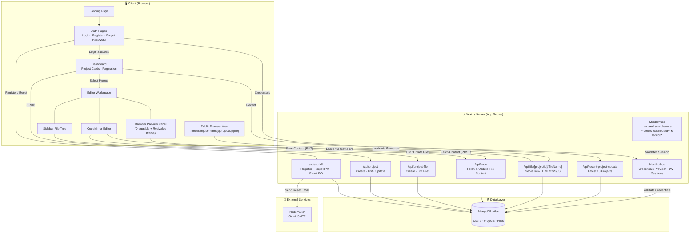
```mermaid
graph TD
    subgraph Client ["🖥️ Client (Browser)"]
        Landing["Landing Page"]
        AuthPages["Auth Pages\nLogin · Register · Forgot Password"]
        Dashboard["Dashboard\nProject Cards · Pagination"]
        EditorUI["Editor Workspace"]
        Sidebar["Sidebar File Tree"]
        CodeMirror["CodeMirror Editor"]
        Preview["Browser Preview Panel\n(Draggable + Resizable Iframe)"]
        BrowserPage["Public Browser View\n/browser/[username]/[projectId]/[file]"]
    end

    subgraph Server ["⚡ Next.js Server (App Router)"]
        Middleware["Middleware\nnext-auth/middleware\nProtects /dashboard/* & /editor/*"]
        NextAuth["NextAuth.js\nCredentials Provider · JWT Sessions"]
        AuthAPI["/api/auth/*\nRegister · Forgot PW · Reset PW"]
        ProjectAPI["/api/project\nCreate · List · Update"]
        FileAPI["/api/project-file\nCreate · List Files"]
        CodeAPI["/api/code\nFetch & Update File Content"]
        RawFileAPI["/api/file/[projectId]/[fileName]\nServe Raw HTML/CSS/JS"]
        RecentAPI["/api/recent-project-update\nLatest 10 Projects"]
    end

    subgraph Database ["🗄️ Data Layer"]
        MongoDB[("
            MongoDB Atlas\n
            Users · Projects · Files
        ")]
    end

    subgraph External ["📧 External Services"]
        Email["Nodemailer\nGmail SMTP"]
    end

    Landing --> AuthPages
    AuthPages -->|"Login Success"| Dashboard
    Dashboard -->|"Select Project"| EditorUI
    EditorUI --- Sidebar
    EditorUI --- CodeMirror
    EditorUI --- Preview

    AuthPages -->|"Credentials"| NextAuth
    AuthPages -->|"Register / Reset"| AuthAPI
    Middleware -->|"Validates Session"| NextAuth

    Sidebar -->|"List / Create Files"| FileAPI
    CodeMirror -->|"Fetch Content (POST)"| CodeAPI
    CodeMirror -->|"Save Content (PUT)"| CodeAPI
    Preview -->|"Loads via iframe src"| RawFileAPI
    BrowserPage -->|"Loads via iframe src"| RawFileAPI
    Dashboard -->|"CRUD"| ProjectAPI
    Dashboard -->|"Recent"| RecentAPI

    AuthAPI --> MongoDB
    ProjectAPI --> MongoDB
    FileAPI --> MongoDB
    CodeAPI --> MongoDB
    RawFileAPI --> MongoDB
    RecentAPI --> MongoDB
    NextAuth -->|"Validate Credentials"| MongoDB
    AuthAPI -->|"Send Reset Email"| Email
```

---

## Database Schema

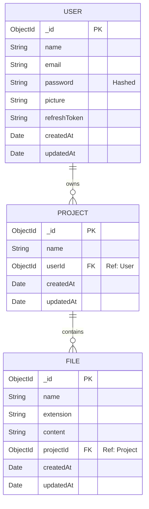
```mermaid
erDiagram
    USER ||--o{ PROJECT : owns
    PROJECT ||--o{ FILE : contains

    USER {
        ObjectId _id PK
        String name
        String email
        String password "Hashed"
        String picture
        String refreshToken
        Date createdAt
        Date updatedAt
    }

    PROJECT {
        ObjectId _id PK
        String name
        ObjectId userId FK "Ref: User"
        Date createdAt
        Date updatedAt
    }

    FILE {
        ObjectId _id PK
        String name
        String extension
        String content
        ObjectId projectId FK "Ref: Project"
        Date createdAt
        Date updatedAt
    }
```
---

## Application User Flow

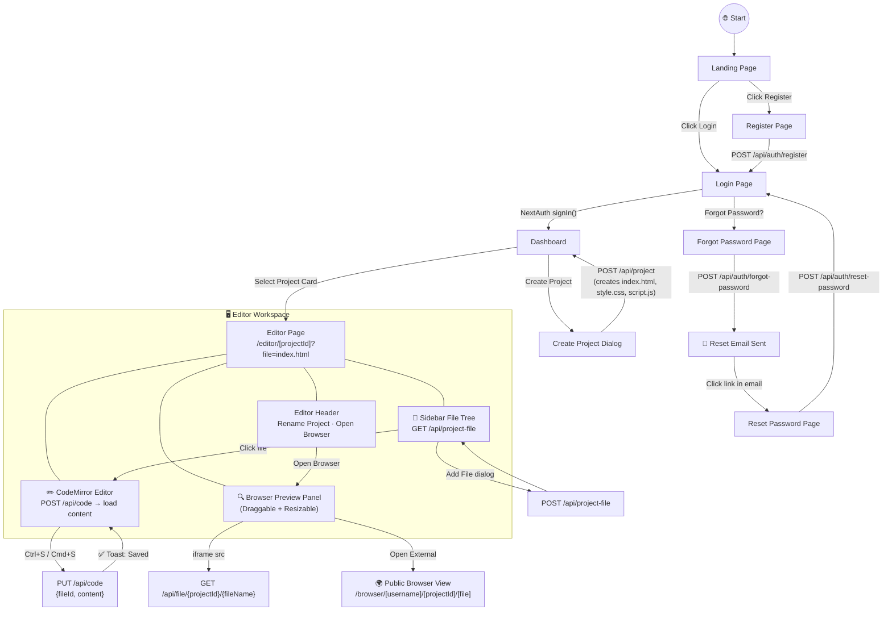
```mermaid
flowchart TD
    Start(("🌐 Start")) --> LandingPage["Landing Page"]
    LandingPage -->|"Click Login"| LoginPage["Login Page"]
    LandingPage -->|"Click Register"| RegisterPage["Register Page"]

    RegisterPage -->|"POST /api/auth/register"| LoginPage
    LoginPage -->|"NextAuth signIn()"| Dashboard["Dashboard"]

    LoginPage -->|"Forgot Password?"| ForgotPW["Forgot Password Page"]
    ForgotPW -->|"POST /api/auth/forgot-password"| EmailSent["📧 Reset Email Sent"]
    EmailSent -->|"Click link in email"| ResetPW["Reset Password Page"]
    ResetPW -->|"POST /api/auth/reset-password"| LoginPage

    Dashboard -->|"Create Project"| NewProjectModal["Create Project Dialog"]
    NewProjectModal -->|"POST /api/project\n(creates index.html, style.css, script.js)"| Dashboard
    Dashboard -->|"Select Project Card"| EditorPage["Editor Page\n/editor/[projectId]?file=index.html"]

    subgraph IDE ["🖥️ Editor Workspace"]
        direction TB
        EditorPage --- FileTree["📁 Sidebar File Tree\nGET /api/project-file"]
        EditorPage --- Header["Editor Header\nRename Project · Open Browser"]
        EditorPage --- CodeArea["✏️ CodeMirror Editor\nPOST /api/code → load content"]
        EditorPage --- PreviewPanel["🔍 Browser Preview Panel\n(Draggable + Resizable)"]
    end

    FileTree -->|"Click file"| CodeArea
    FileTree -->|"Add File dialog"| CreateFile["POST /api/project-file"]
    CreateFile --> FileTree

    CodeArea -->|"Ctrl+S / Cmd+S"| SaveFile["PUT /api/code\n{fileId, content}"]
    SaveFile -->|"✅ Toast: Saved"| CodeArea

    Header -->|"Open Browser"| PreviewPanel
    PreviewPanel -->|"iframe src"| RawAPI["GET /api/file/{projectId}/{fileName}"]
    PreviewPanel -->|"Open External"| BrowserView["🌍 Public Browser View\n/browser/[username]/[projectId]/[file]"]
```
---

## Installation

1. Clone the repository:
   ```bash
   git clone https://github.com/UjjwalPrajapati16/pixel-ide.git
   cd pixel-ide
   ```
2. Install dependencies:
   ```bash
   npm install
   ```

3. Set up environment variables: Create a `.env` file in the root directory and add the following:

   ```bash
    MONGODB_URI=your_mongodb_connection_string
    NEXTAUTH_SECRET=your_nextauth_secret
    NEXTAUTH_URL=http://localhost:3000
    NEXT_PUBLIC_BASE_URL=http://localhost:3000
    FORGOT_PASSWORD_SECRET_KEY=your_forgot_password_secret
    EMAIL_USER=your_gmail_address
    EMAIL_PASS=your_gmail_app_password
   ```

4. Start the development server:
   ```bash
    npm run dev
   ```

5. Open http://localhost:3000 in your browser.

---

## Screenshots

1. **Landing Page**
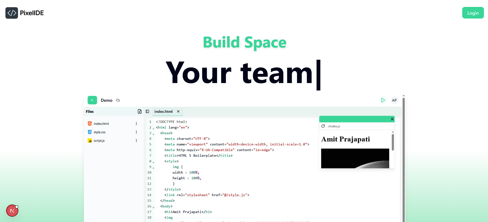

2. **Login Page**
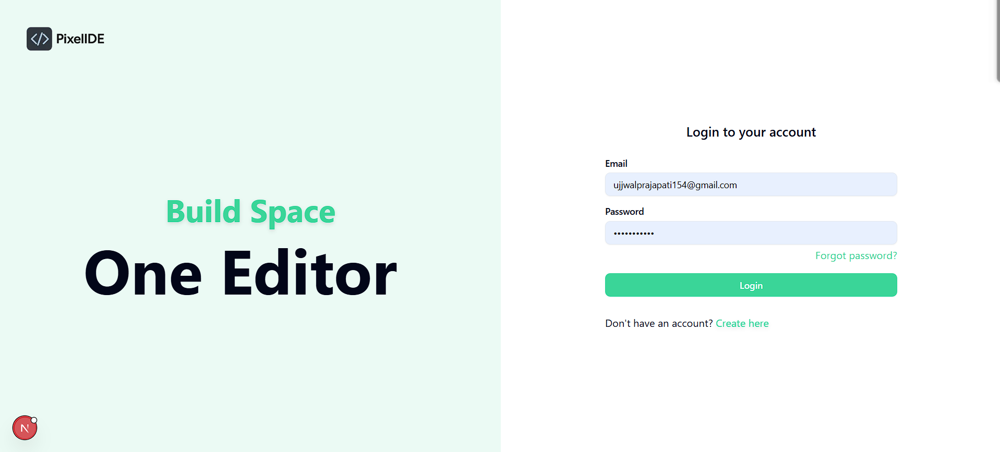

3. **Register Page**
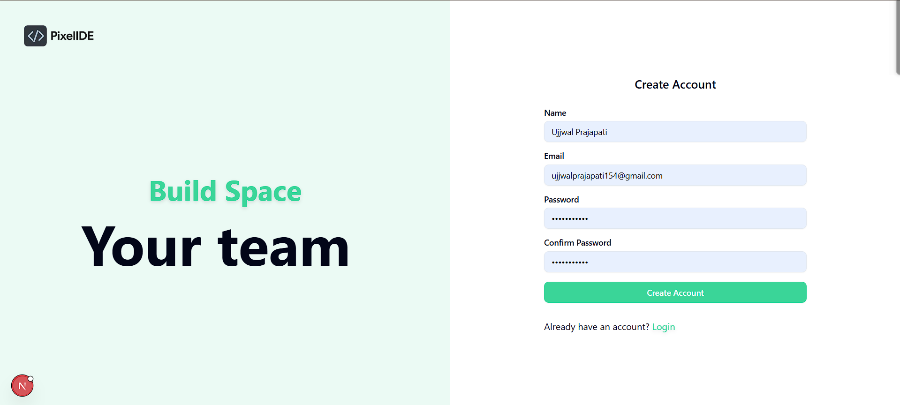

4. **Forgot Password Page**
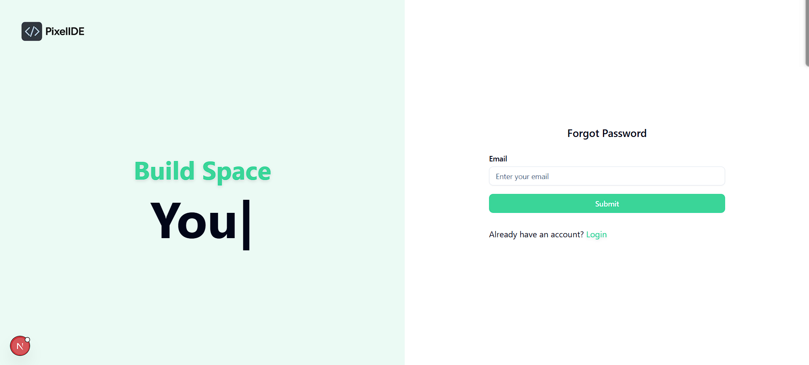

5. **Reset Password Email**
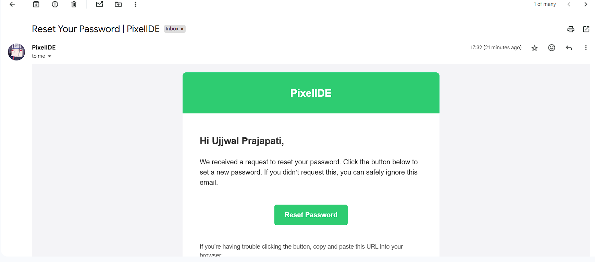

6. **Dashboard**
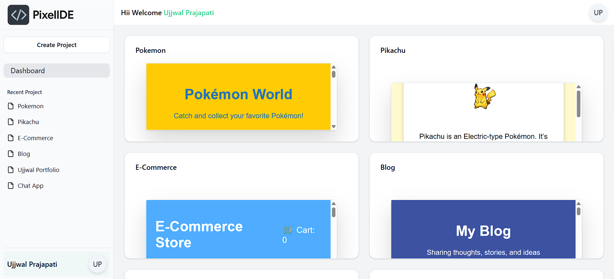

7. **Create Project**
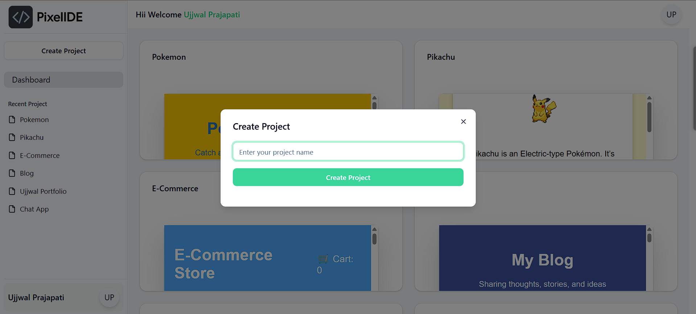

8. **Editor**
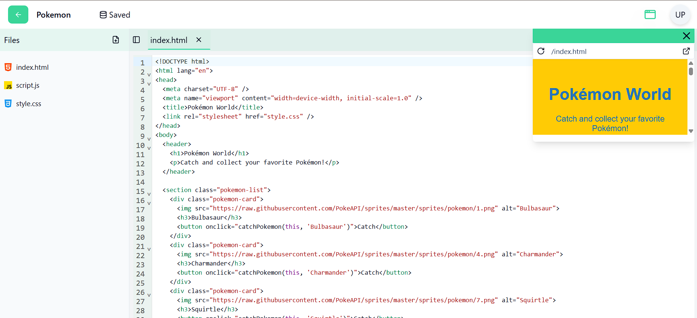


## Future Enhancements

- **Multi-Language Support**: Add support for additional programming languages (Python, TypeScript, etc.) with server-side execution.
- **Collaborative Editing**: Real-time multi-user editing with WebSockets.
- **File Delete & Rename**: Add ability to delete and rename files from the sidebar.
- **Project Delete**: Add ability to delete projects from the dashboard.
- **Version History**: Track and restore previous file versions.
